# OMV — Design Review

**Phase 1 (Foundation):** ✅ Approved — live at https://omv-iota.vercel.app/
**Phase 2 (Storefront):** Awaiting your approval

This document walks through every screen built so far: what it's for, the
UX decisions behind it, which reusable components it's built from, and how it
behaves across devices and themes. Full-resolution PNGs are in `/preview`.

---

# Phase 2 — Storefront

## 4. Catalogue (Women / Men / Kids)

**Purpose:** Browse and narrow down products within a category. Same
component (`CatalogueView`) powers all three category routes so filter
behavior and layout stay identical across `/women`, `/men`, `/kids`.

### Desktop — Dark theme
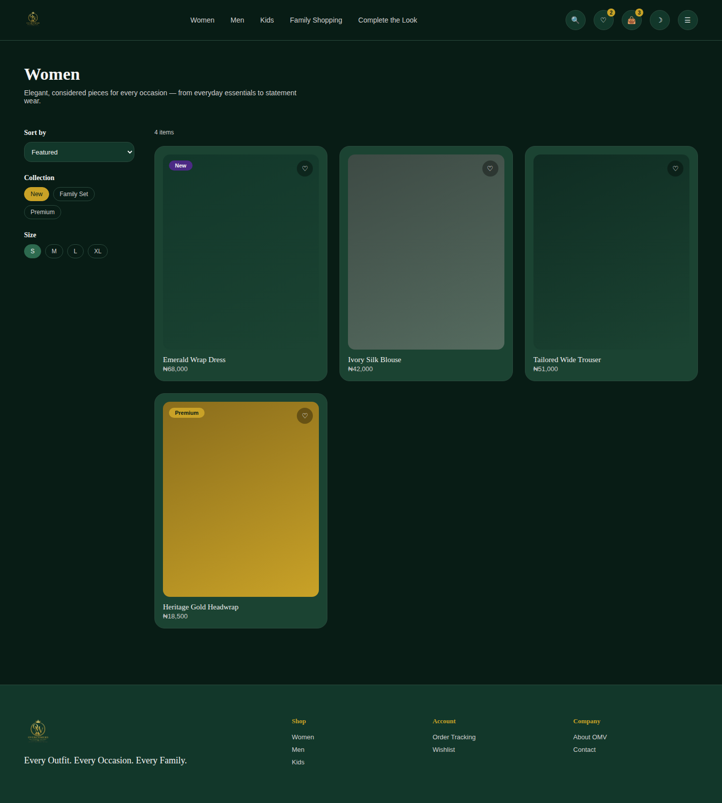

### Desktop — Light theme
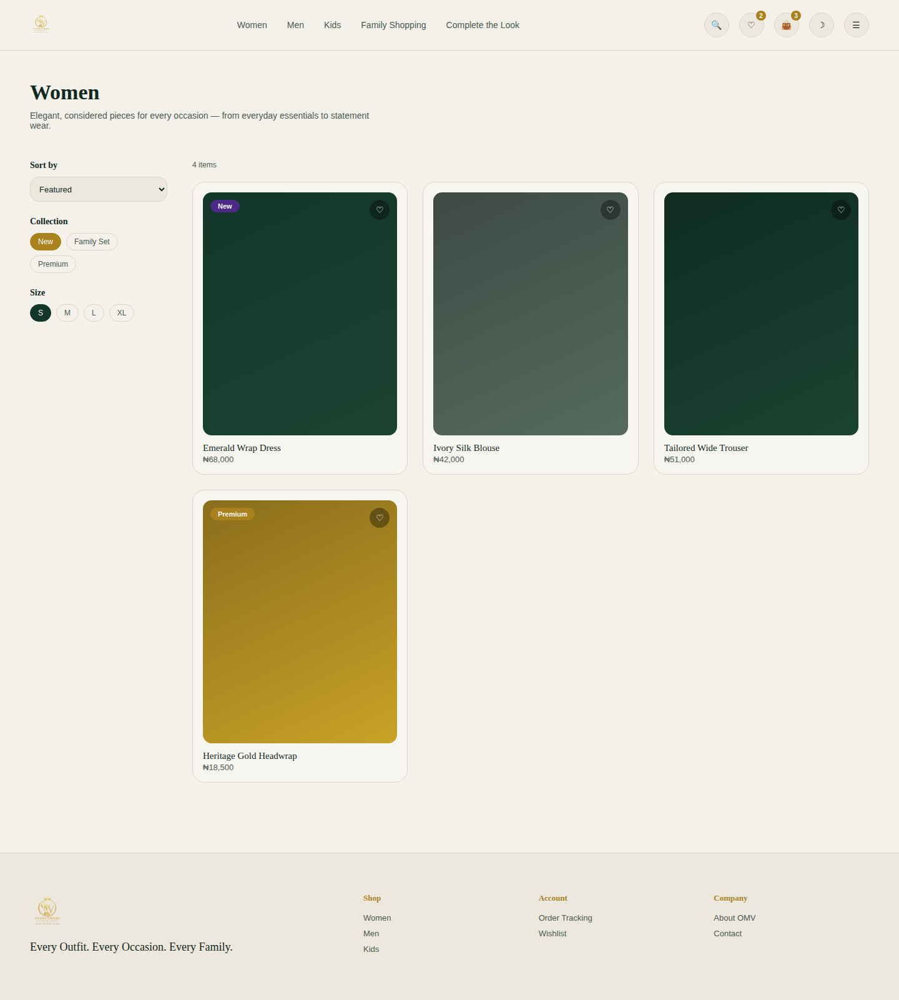

### Mobile
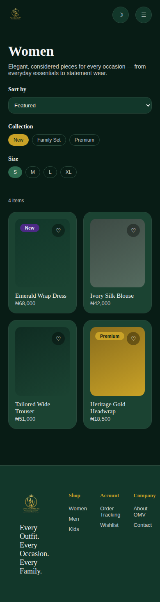

**UX decisions**
- No real photography yet (same decision as Phase 1's landing page), so each
  product tile uses a brand-toned gradient placeholder instead of a stock
  photo or broken image icon — it reads as an intentional, elegant "coming
  soon" treatment rather than a bug.
- Filters are collection badge (New / Family Set / Premium), size, and sort
  — deliberately not sprawling; the Brand Book calls for "less clutter."
  Sidebar collapses to sit above the grid on mobile.
- Wishlist heart sits directly on each tile so saving an item never requires
  opening the product page first.

**Components used:** `CatalogueView`, `FilterSidebar`, `ProductTile`, `Card`.

**Accessibility:** filter chips are real `<button>`s with visible active
state (color, not just an icon); size filter uses the primary color to stay
visually distinct from the badge filter's gold so the two facets aren't
confusable at a glance.

**Responsive behavior:** 3-column grid (desktop) → 2-column (mobile).
Sidebar becomes a stacked block above the grid below `lg`.

---

## 5. Product Detail Page

**Purpose:** Convert interest into an add-to-cart decision, and surface
"Complete the Look" pairings to increase basket size — a named USP in the
Brand Book.

### Desktop — Dark theme
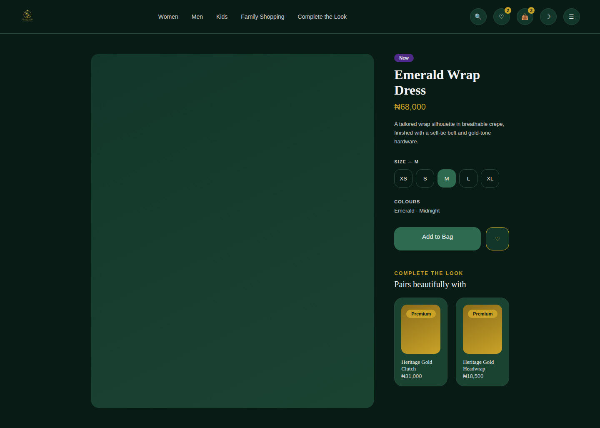

### Desktop — Light theme
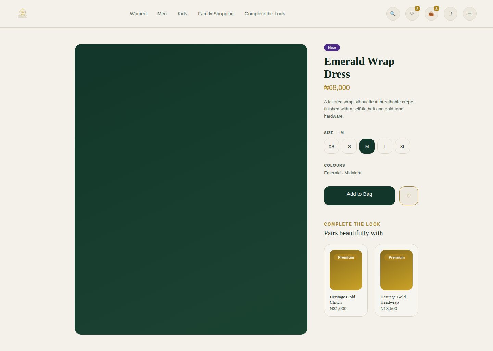

### Mobile
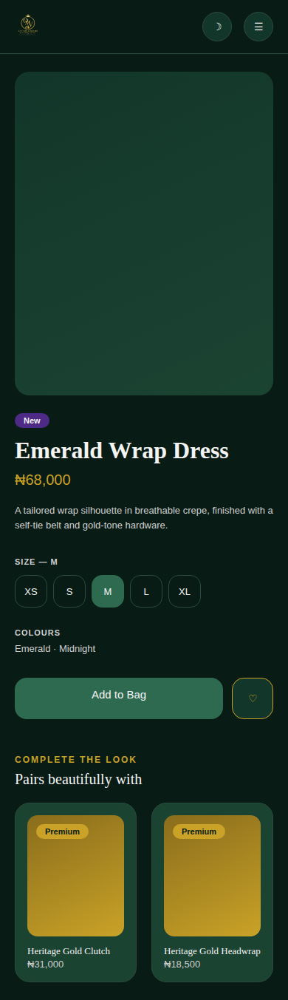

**UX decisions**
- Size selection uses a real `role="radiogroup"` of buttons, not a
  `<select>` — sizes are a primary decision, not a secondary setting, so
  they deserve full visual weight.
- "Add to Bag" gives inline confirmation ("Added to bag ✓") for two seconds
  rather than a toast, keeping the action feedback anchored to where the
  user's attention already is.
- "Complete the Look" pulls real related products from the catalogue data
  (`completeTheLook` product-id references) rather than a generic "you may
  also like" — it's the specific styling pairing the Brand Book describes.

**Components used:** `ProductDetail` (client) + `ProductTile` for the
related-items row, `Button`.

**Accessibility:** size buttons expose `role="radio"`/`aria-checked`; the
wishlist toggle button has a state-aware `aria-label` and `aria-pressed`.

**Responsive behavior:** two-column (image + info) collapses to a single
stacked column below `lg`; size and colour rows wrap naturally at any width.

---

## 6. Wishlist

**Purpose:** A holding space for items a customer isn't ready to buy yet —
persists across visits (stored locally for now; will move to the account
API in Phase 5).

### Desktop
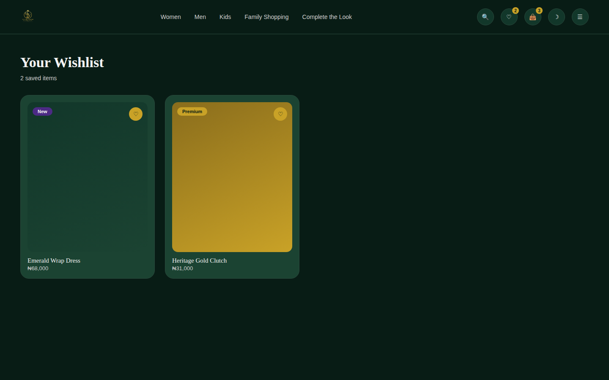

**UX decisions:** Empty state routes straight back into `/women` rather
than a dead end — never leaves the customer with nowhere to go.

**Components used:** `ProductTile` (same tile as the catalogue, so hearts,
badges and pricing behave identically everywhere).

**Accessibility:** heart buttons are `aria-pressed`, with a label that
states current state ("Remove X from wishlist" vs "Add X to wishlist").

**Responsive behavior:** 4-column grid → 2-column on mobile, same grid
system as the catalogue.

---

## 7. Cart

**Purpose:** Review and adjust everything before checkout — quantities,
sizes, removal — with a persistent running total.

### Desktop
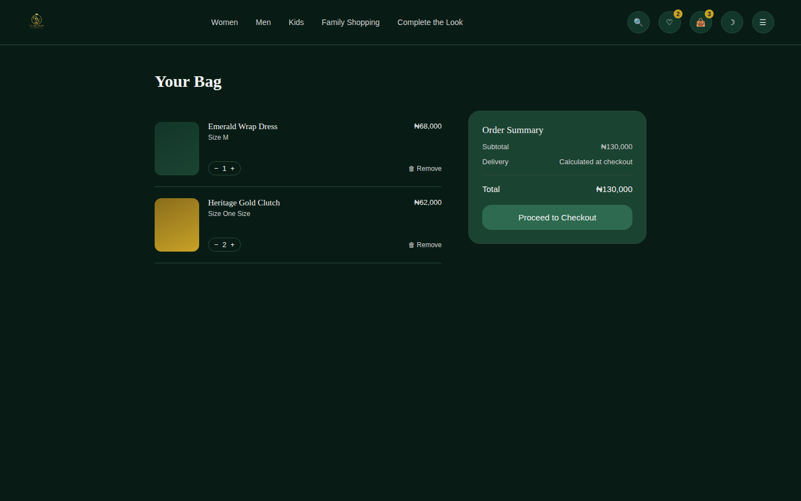

### Mobile
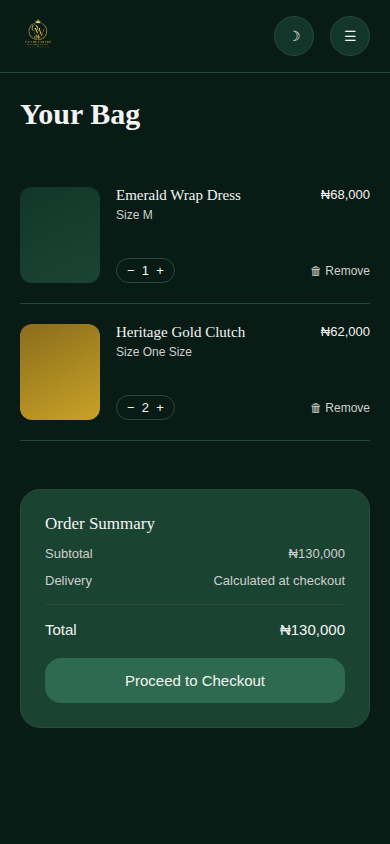

**UX decisions**
- Quantity stepper instead of a free-text field — fewer invalid states,
  faster to use on mobile.
- Order summary is sticky-positioned in its own column on desktop so the
  total and checkout button are always visible while reviewing line items.
- Empty-state again routes back into shopping rather than showing a bare
  "no items" message.

**Components used:** custom cart list (built directly in `app/cart/page.tsx`
against `useCart()`), `Button`.

**Accessibility:** quantity value is `aria-live="polite"` so screen-reader
users hear the updated count after +/-; every icon-only control has an
`aria-label` naming the specific product it acts on.

**Responsive behavior:** summary column moves below the line-item list on
mobile instead of sitting beside it.

---

## 8. Checkout

**Purpose:** Capture shipping details and confirm the order. Payment
gateway integration is explicitly out of scope for Phase 2 (that's Phase 5's
NestJS + payment gateway work) — this proves the *flow* end to end.

### Desktop — Form
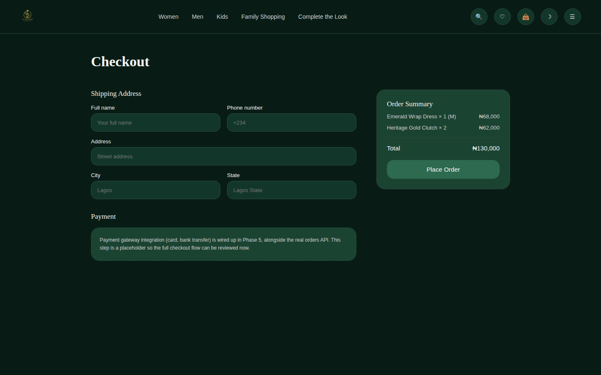

### Desktop — Confirmation
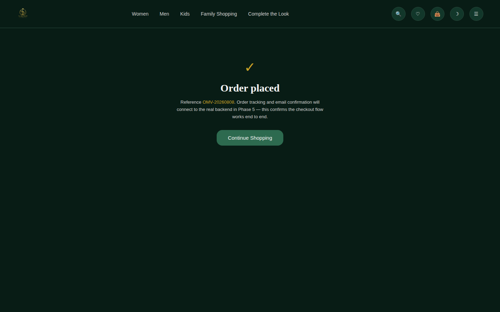

**UX decisions**
- The payment section is visibly marked as a placeholder (dashed border,
  explanatory copy) rather than a fake-looking card form — I did not want
  to build something that *looks* like it processes real payment when it
  doesn't.
- Placing an order generates a local reference number and clears the cart,
  so you can test the complete "browse → cart → checkout → confirmation"
  loop today, before Phase 5 wires it to a real orders API.

**Components used:** `Input`, `Button`, order-summary pattern shared
visually with the Cart page.

**Accessibility:** every shipping field has a real label and appropriate
`autoComplete` hint (`name`, `tel`, `street-address`, etc.) for autofill and
screen readers alike.

**Responsive behavior:** form fields go from a 2-column grid to a single
column below `lg`; order summary moves below the form on mobile.

---

## 9. Family Shopping

**Purpose:** Let a customer build lightweight profiles for family members
(name, relation, size notes) and mark one as "active" while shopping — the
Brand Book's signature family-first differentiator.

### Desktop
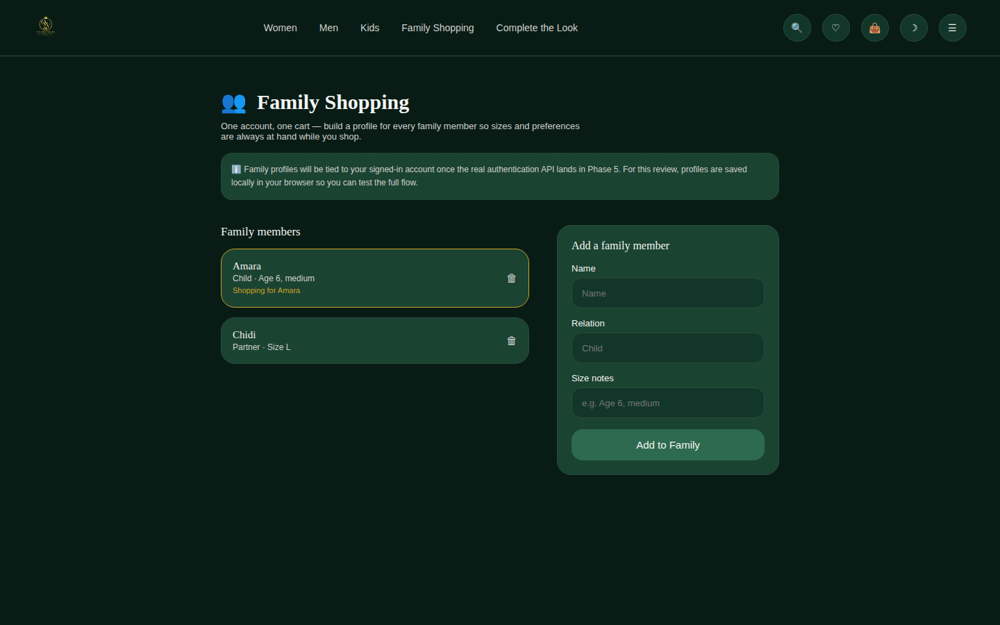

**UX decisions**
- I added an explicit, visible note that profiles are browser-local until
  Phase 5's real authentication ships — the PRD requires login for family
  profiles, but building the full auth-gated version now would block you
  from reviewing the feature at all. Flagging this as a deliberate,
  temporary decision rather than silently building around the requirement.
- "Active" profile is a single click on the card itself (not a separate
  button), since switching who you're shopping for should feel as light as
  it is conceptually.

**Components used:** `Card`, `Input`, `Button`, `useFamily()` context.

**Accessibility:** each member card's primary click target is a real
`<button>` covering the name/relation text; delete action is a separately
labelled icon button so the two actions can't be mis-tapped for each other.

**Responsive behavior:** two-column (list + add-form) collapses to a single
stacked column below `lg`.

---

# Phase 1 — Foundation (approved)

## 1. Home / Landing Page

**Purpose:** First impression of the brand. Establishes the "boutique, not
marketplace" positioning before any product catalogue exists, and routes
people toward shopping or family-account creation.

### Desktop — Dark theme (primary)
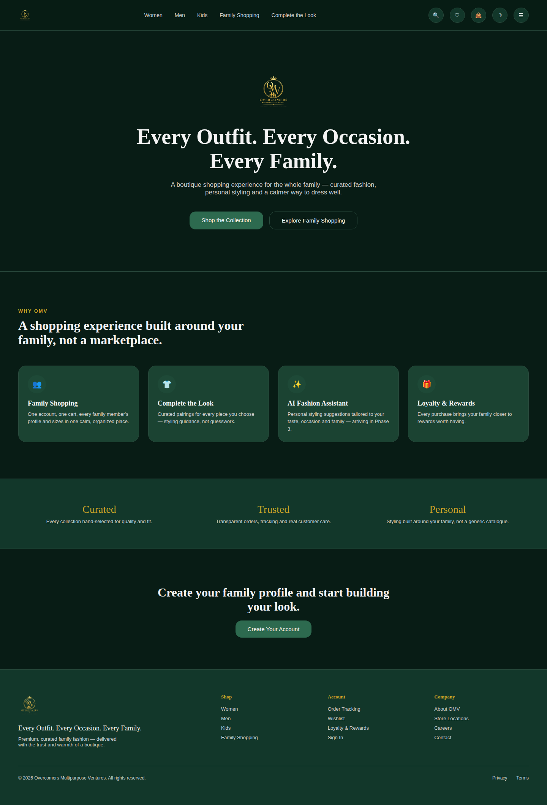

### Desktop — Light theme
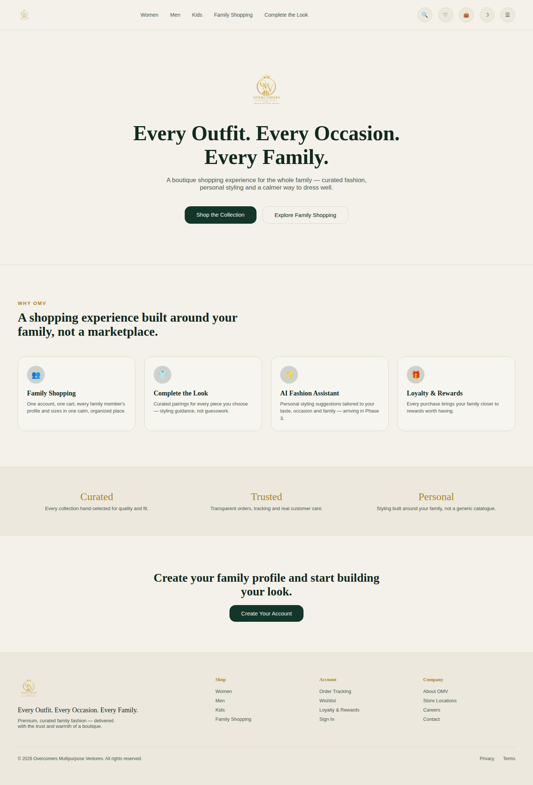

### Mobile
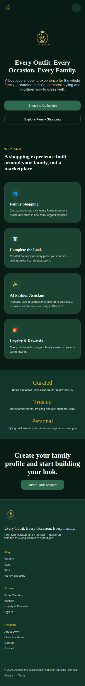

### Mobile menu (open state)
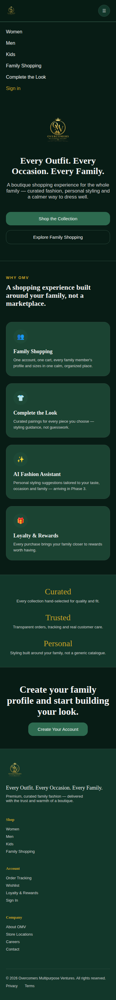

**UX decisions**
- Hero leads with the full logo lockup and the official tagline, not a
  generic banner — the brand *is* the opening statement.
- No stock photography. The Brand Book explicitly rejects generic stock
  images, and no real product/lifestyle photography has been supplied yet —
  showing placeholder photos would misrepresent the eventual brand.
- Four "brand pillar" cards (Family Shopping, Complete the Look, AI Fashion
  Assistant, Loyalty) instead of a product grid — Phase 1 has no catalogue
  yet, so the page sells the *experience*, not products.
- Purple is used only on the AI Fashion Assistant icon (Brand Book §15:
  purple = AI features only). Gold appears only in the eyebrow label and
  trust-strip headlines — deliberately sparing use per "don't overuse gold."

**Components used:** `Navbar`, `Footer`, `Card` / `CardTitle` / `CardDescription`, `Button` (primary + outline variants).

**Accessibility**
- Skip-to-content link (visible on keyboard focus).
- All icon-only buttons (search, wishlist, bag, theme toggle, menu) have
  `aria-label`s.
- Mobile menu button has `aria-expanded` / `aria-controls`.
- Heading hierarchy: one `h1` (hero), `h2`s for each section, `h3`s for
  pillar card titles.

**Responsive behavior:** Desktop nav collapses to a hamburger + slide-down
mobile menu below the `lg` breakpoint. Pillar grid: 4 columns → 2 → 1. Hero
button row stacks vertically on mobile. Footer link columns stack to a single
column.

---

## 2. Sign In

**Purpose:** Authenticate returning customers. Gated only where the PRD
requires login (checkout, wishlist, orders, family profiles, AI
personalization) — browsing itself never requires this page.

### Desktop — Dark theme
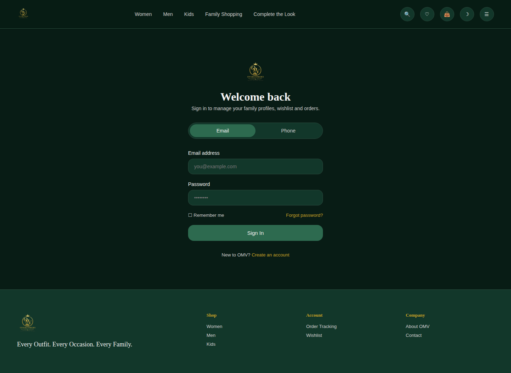

### Desktop — Light theme
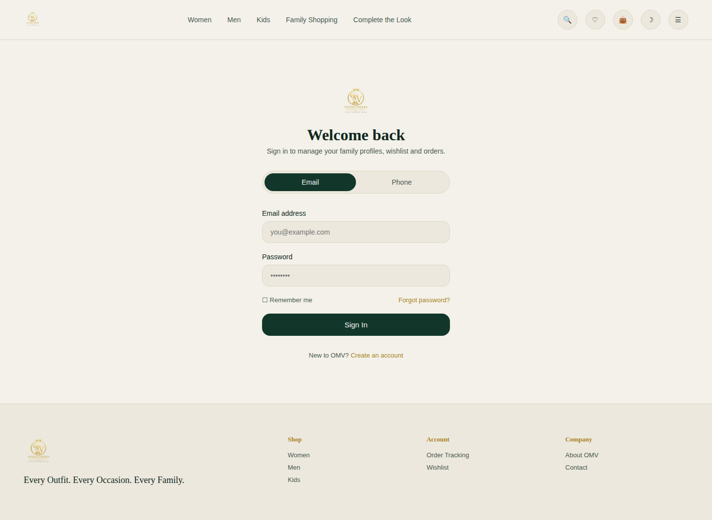

### Mobile
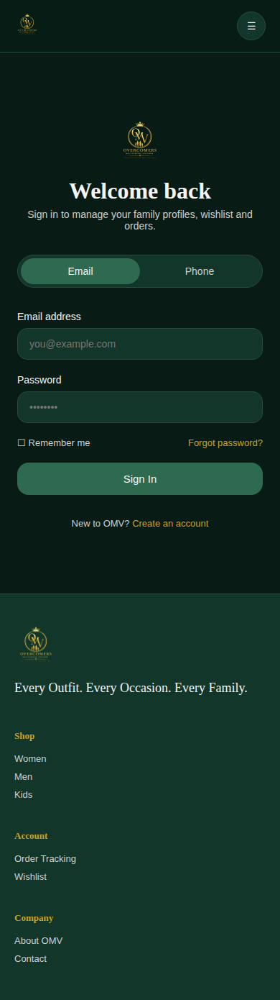

**UX decisions**
- Email/Phone tab switcher matches the PRD's requirement to support both
  login methods without splitting them into separate pages.
- "Remember me" defaults **on** — most returning customers want to stay
  signed in on their own device; unchecking is one click.
- Full logo lockup appears here (an approved usage location) to keep the
  auth flow feeling like part of the same boutique experience, not a bare
  utility form.

**Components used:** `Input` (labelled, with `aria-describedby` wiring),
`Button`, tab control (native `role="tablist"`/`role="tab"`).

**Accessibility**
- Every input has a real, associated `<label>` (not a placeholder standing
  in for one).
- Password field uses `autoComplete="current-password"`; email uses
  `autoComplete="email"`.
- Form errors are wired to `role="alert"` and `aria-invalid` (not yet visible
  here since there's no backend to reject input against — the wiring exists
  in `components/ui/Input.tsx` for Phase 5).

**Responsive behavior:** Single-column form at all sizes by design — a
sign-in form does not need a wider layout. Nav collapses the same way as the
home page below `lg`.

---

## 3. Create Account

**Purpose:** New customer registration — the entry point into the loyalty,
wishlist and family-profile features.

### Desktop — Dark theme
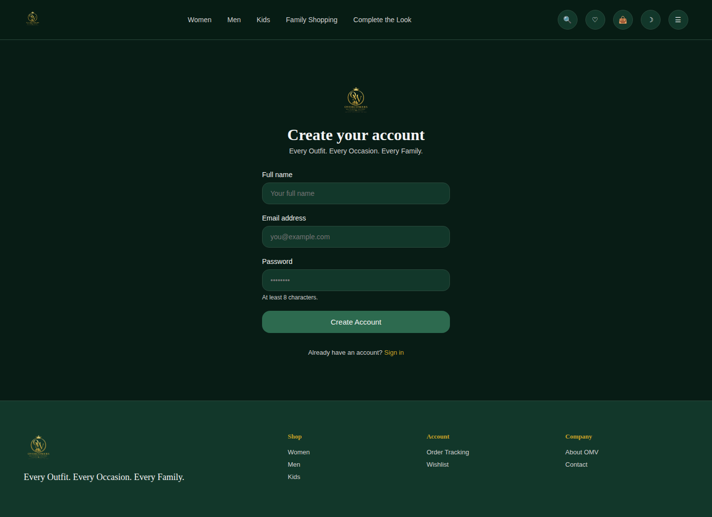

### Desktop — Light theme
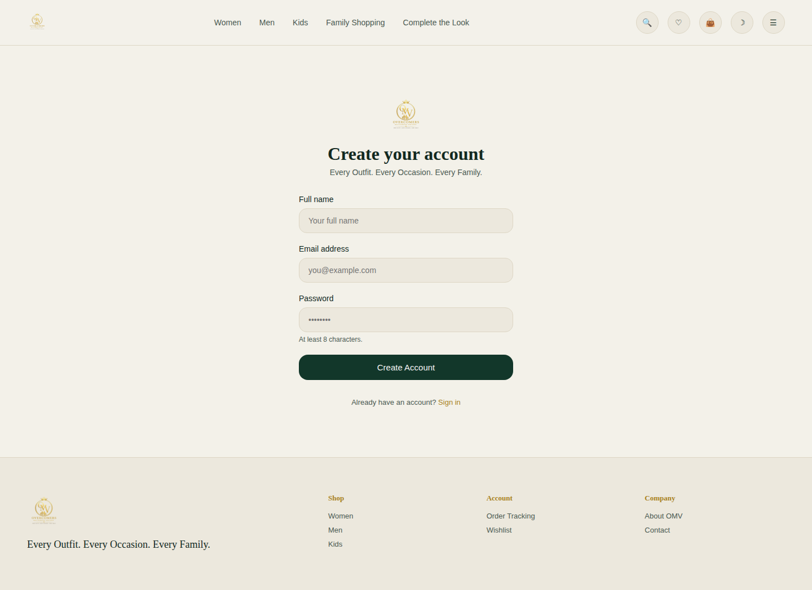

**UX decisions**
- Deliberately short (name, email, password) — family member profiles and
  address details are collected later in the dashboard (Phase 3), not
  front-loaded here where they'd raise drop-off risk.
- Password field carries a plain-language hint ("At least 8 characters")
  instead of a strength meter, matching the calm, non-intrusive tone the
  Brand Book asks for.

**Components used:** Same `Input` / `Button` set as Sign In, for visual and
behavioral consistency between the two auth flows.

**Accessibility:** Same pattern as Sign In — labelled fields, `autoComplete`
hints (`name`, `email`, `new-password`).

**Responsive behavior:** Same single-column, centered layout at all sizes.

---

## Theme system (applies to every page above)

Dark is the default/primary brand experience (Brand Book). Light is derived
from the same palette — warm parchment instead of white, deep-emerald ink
instead of black, no bright green anywhere, gold deepened slightly for
contrast on light surfaces. Every screen above was captured in both modes
except the two auth pages' mobile views, which follow the identical layout
already shown for Home.

## What still needs your review (Phase 2)

- Product placeholder treatment (gradient tiles) — acceptable until real
  photography exists, or would you prefer a different placeholder style?
- Family Shopping being usable pre-login (browser-local) as an interim
  state ahead of Phase 5 auth — confirm you're fine with that sequencing.
- Checkout's placeholder payment section — confirm the messaging reads
  right, since no real payment integration exists yet.
- Mock product catalogue (names, prices, categories) — first pass, meant to
  exercise the UI, not final merchandising content.
- Anything missing from Phase 2's scope before Phase 3 begins.

## Phase 1 review notes (for reference — already approved)

- Dark/light color choices, typeface pairing, and landing-page copy were
  all approved as part of Phase 1 sign-off.
